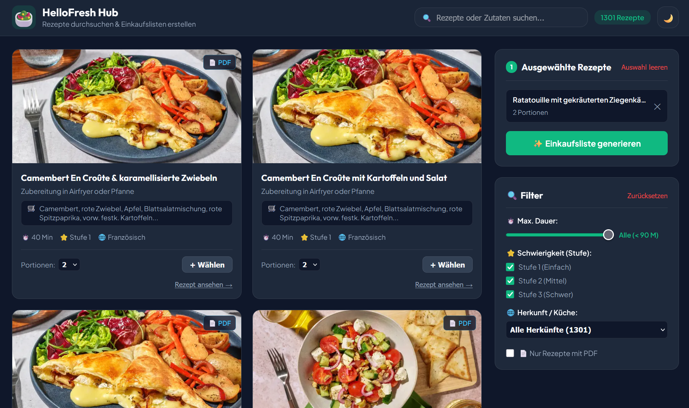

# 🥗 HelloFresh Recipe Hub & Einkaufslisten-Generator


Eine durchgängige Full-Stack-Anwendung und CLI-Utility-Suite zum Crawlen von HelloFresh-Rezepten, Durchsuchen und Filtern von Rezeptsammlungen, automatischen Skalieren von Portionsgrößen, Aggregieren von Zutaten in kategorisierte Supermarkt-Einkaufslisten sowie zum Exportieren oder Versenden von Listen per E-Mail als Markdown-Notizen.



---

## 🌟 Hauptfunktionen

- 🌐 **Modernes interaktives Web-Dashboard**:
  - **Glassmorphism-Design**: Elegante Benutzeroberfläche mit Hell-/Dunkelmodus und dynamischen Animationen.
  - **Erweiterte Filterung**: Filtern Sie Rezepte nach Zubereitungsdauer, Schwierigkeitsgrad, Küche/Herkunft, Tags und Verfügbarkeit der Original-PDF-Rezeptkarte.
  - **Echtzeitsuche**: Live-Suche über Titel, Beschreibungen und Zutaten.
  - **Portionsskalierung**: Zielportionsgrößen pro Rezept dynamisch anpassen, bevor die Einkaufsliste generiert wird.

- 🛒 **Intelligente Supermarkt-Gangkategorisierung**:
  - Identische Zutaten aus mehreren Rezepten automatisch zusammenführen und Mengen aufsummieren.
  - Zutaten in übersichtliche Supermarkt-Kategorien gruppieren:
    - 🥦 *Obst & Gemüse*
    - 🥛 *Kühlregal, Käse & Molkerei*
    - 🥩 *Fleisch, Fisch & Veggie*
    - 🍞 *Brot, Back- & Teigwaren*
    - 🥫 *Konserven, Saucen & Feinkost*
    - 🧂 *Gewürze, Öle, Nüsse & Vorrat*
  - Kennzeichnet Vorratsartikel (`Vorrat`) im Vergleich zu frischen, gelieferten Zutaten.

- 📧 **Ein-Klick-E-Mail-Export**:
  - Strukturierte Markdown-Einkaufslisten direkt per SMTP an Ihr E-Mail-Postfach senden.
  - Erzeugt herunterladbare `.md`-Dateien, die mit Markdown-Notizprogrammen (z. B. Obsidian, Notion, Apple Notes) kompatibel sind.

- 🤖 **Multi-Locale HelloFresh Crawler**:
  - Integrierter Node.js-Crawler zur Abfrage der HelloFresh-REST-APIs.
  - Basierend auf dem Open-Source-Projekt **[HelloFreshCrawler](https://github.com/alexcodito/HelloFreshCrawler)** von **[@alexcodito](https://github.com/alexcodito/)** (erweitert um eine Option zum ausschließlichen Download vegetarischer Rezepte / ohne Landfleisch).
  - Unterstützt Regionen/Sprachen: Deutschland (`DE`), USA (`US`), Großbritannien (`GB`), Frankreich (`FR`).
  - Lädt strukturierte JSON-Rezeptdaten und Original-PDF-Rezeptkarten herunter.

---

## 📁 Projektstruktur

```
hf_recipe_to_notes/
├── server.py                   # Flask-REST-API-Backend & statischer Dateiserver
├── .env.example                # Beispiel-Umgebungskonfigurationsdatei
├── .gitignore                  # Git-Ignore-Regeln
├── README.md                   # Projektdokumentation (Deutsch)
│
├── web/                        # Web-Dashboard-Frontend
│   ├── index.html              # HTML-Struktur der Single-Page-Application
│   ├── style.css               # Glassmorphism-Designsystem & responsives Styling
│   └── app.js                 # Frontend-REST-API-Einbindung & Zustandsverwaltung
│
└── HelloFreshCrawler/          # Node.js-Rezept-Crawler (basiert auf alexcodito/HelloFreshCrawler)
    ├── index.js                # Crawler CLI-Einstiegspunkt
    ├── package.json            # Node.js-Abhängigkeiten (axios, yargs)
    ├── services/
    │   └── hello-fresh.js      # HelloFresh-REST-API-Client & PDF-Downloader
    └── downloads_de/           # Gecrawlte JSON-Rezepte & PDF-Rezeptkarten
```

---

## 🛠️ Voraussetzungen

Stellen Sie sicher, dass die folgenden Programme auf Ihrem System installiert sind:
- **Python**: Version `3.8` oder höher
- **Node.js**: Version `14.0` oder höher
- **npm**: In Node.js enthalten

---

## 📦 Installation & Einrichtung

### 1. Repository klonen
```bash
git clone https://github.com/ihr-benutzername/hf_recipe_to_notes.git
cd hf_recipe_to_notes
```

### 2. Virtuelle Python-Umgebung einrichten
```bash
# Virtuelle Umgebung erstellen
python -m venv venv

# Aktivieren unter Windows (PowerShell):
venv\Scripts\Activate.ps1
# Oder Windows (CMD):
venv\Scripts\activate.bat
# Oder macOS / Linux:
source venv/bin/activate
```

### 3. Python-Abhängigkeiten installieren
```bash
pip install flask
```

### 4. Node.js-Crawler-Abhängigkeiten installieren
```bash
cd HelloFreshCrawler
npm install
cd ..
```

### 5. Umgebungskonfiguration (.env)
Kopieren Sie die Datei `.env.example` in eine neue Datei namens `.env` im Stammverzeichnis:
```bash
cp .env.example .env
```
*(Optional)* Fügen Sie Ihre SMTP-Konfiguration in die `.env`-Datei ein, falls Sie Standardwerte für den E-Mail-Versand speichern möchten:
```env
SMTP_SERVER=mail.gmx.net
SMTP_PORT=587
SMTP_USER=ihre_email@gmx.net
SMTP_PASSWORD=ihr_app_passwort
RECIPIENT_EMAIL=ihre_email@gmx.net
```
> **Hinweis**: Sie können Ihr SMTP-Passwort auch direkt und sicher zur Laufzeit in der Web-Oberfläche eingeben, ohne es in der `.env`-Datei zu speichern.

---

## 🚀 Bedienungsanleitung

### A. HelloFresh Crawler ausführen (Einmalig vor dem Webapp-Start)

Bevor Sie die Web-Anwendung zum ersten Mal starten, müssen Sie den HelloFresh Crawler einmal ausführen, um die Rezeptdaten herunterzuladen:

1. Wechseln Sie in das Crawler-Verzeichnis:
   ```bash
   cd HelloFreshCrawler
   ```
2. Starten Sie den Crawler über die CLI mit Angabe von Region und Zielverzeichnis:
   ```bash
   # Deutsche Rezepte crawlen und unter ./downloads_de speichern
   node index.js HelloFresh -l DE -s ./downloads_de

   # US-Rezepte ohne Fleischfilter crawlen
   node index.js HelloFresh -l US -s ./downloads_us --no-noMeat
   ```
   **CLI-Argumente**:
   | Argument | Alias | Beschreibung | Standard | Optionen |
   |---|---|---|---|---|
   | `--locale` | `-l` | Region/Sprache für den Crawl-Vorgang | `US` | `DE`, `GB`, `US`, `FR` |
   | `--recipeCardSaveDirectory` | `-s` | Speicherpfad für PDFs und JSONs | `./recipe-card-pdfs` | *Pfad-String* |
   | `--noMeat` | `-m` | Landfleisch/Geflügel herausfiltern | `true` | `true` / `false` |

3. Kehren Sie in das Hauptverzeichnis zurück:
   ```bash
   cd ..
   ```

---

### B. Web-Anwendung ausführen

Nachdem die Rezeptdaten gecrawlt wurden, können Sie das Web-Dashboard starten:

1. Starten Sie den Flask-Backend-Server:
   ```bash
   python server.py
   ```
2. Öffnen Sie Ihren Webbrowser und rufen Sie folgende Adresse auf:
   ```
   http://localhost:5000
   ```
3. **Funktionen im Web-Hub**:
   - Suchen Sie Rezepte nach Name oder Zutat in der Suchleiste.
   - Nutzen Sie die rechten Filter-Optionen, um maximale Zubereitungszeit, Schwierigkeitsgrad oder Küche einzustellen.
   - Klicken Sie auf **"+ Auswählen"** auf einer Rezeptkarte, um sie zur Auswahl hinzuzufügen.
   - Passen Sie die Anzahl der Portionen pro Rezept über die `+` / `-` Buttons an.
   - Klicken Sie auf **"✨ Einkaufsliste generieren"**, um die aggregierte Liste zu erstellen.
   - Vorschau der Markdown-Ausgabe anzeigen, in die Zwischenablage kopieren oder auf **"📧 Per E-Mail senden"** klicken, um die Liste an sich selbst zu senden.

---

## 🏗️ Supermarkt-Gangkategorisierung

Die Anwendung sortiert Zutaten automatisch in typische Supermarkt-Gänge ein:

| Supermarkt-Gang | Kategorie-Icon | Typische Zutaten |
|---|---|---|
| **Obst & Gemüse** | 🥦 | Tomaten, Zwiebeln, Knoblauch, Kartoffeln, Kräuter, Chilis, Gurken |
| **Kühlregal, Käse & Molkerei** | 🥛 | Milch, Butter, Eier, Feta, Mozzarella, Sahne, Joghurt |
| **Fleisch, Fisch & Veggie** | 🥩 | Hähnchen, Rind, Schwein, Tofu, Lachs, Bacon, Hackfleisch |
| **Brot, Back- & Teigwaren** | 🍞 | Reis, Pasta, Wraps, Gnocchi, Baguettes, Tortillas |
| **Konserven, Saucen & Feinkost**| 🥫 | Tomatenmark, Kokosmilch, Pesto, Mayo, Oliven, Chutneys |
| **Gewürze, Öle, Nüsse & Vorrat**| 🧂 | Olivenöl, Gewürze, Brühe, Mehl, Zucker, Nüsse, Samen |

---

## 🙏 Danksagung & Credits

Ein besonderer Dank geht an die Entwickler des ursprünglichen HelloFresh-Crawlers:
- **[HelloFreshCrawler](https://github.com/alexcodito/HelloFreshCrawler)** von **Alex Papounidis ([@alexcodito](https://github.com/alexcodito/))** sowie weiteren Mitwirkenden wie **[@kevinrodd](https://github.com/kevinrodd/)**.
- Das ursprüngliche Crawler-Projekt bildet das Fundament für das Unterverzeichnis `HelloFreshCrawler/`. In dieser Repository wurde der Crawler um eine Option zur gezielten Filterung vegetarischer Rezepte bzw. zum Filtern von Landfleisch/Geflügel (`--noMeat` / `-m`) erweitert.

---

## 🤝 Mitwirken (Contributing)

Beiträge sind herzlich willkommen! Wenn Sie den Crawler verbessern, die Benutzeroberfläche erweitern oder neue Kategorisierungslogik hinzufügen möchten:

1. Forken Sie das Repository.
2. Erstellen Sie Ihren Feature-Branch (`git checkout -b feature/TolleFunktion`).
3. Committen Sie Ihre Änderungen (`git commit -m 'TolleFunktion hinzugefügt'`).
4. Pushen Sie auf den Branch (`git push origin feature/TolleFunktion`).
5. Öffnen Sie eine Pull Request.

---

## 📄 Lizenz

Dieses Projekt ist unter der MIT-Lizenz veröffentlicht. Siehe [LICENSE](LICENSE) für Details.
